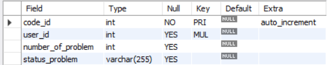
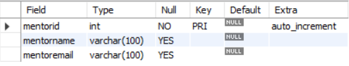

# Design DB model for Guvi Zen class

create database zen_class;

use zen_class;

## Tables
1. users
2. codekata
3. attendance
4. topics
5. tasks
6. company_drives
7. mentors
8. batch_data

## Users Table
create table users(
    user_id int auto_increment primary key,
    user_name varchar (255),
    email varchar (255),
    createdAt datetime,
    batch int
);

insert into users(user_name, email, createdAt, batch) values
('karthik','karthi@gmail.com',CURRENT_TIMESTAMP(),1),
('gayu','gayu@gmail.com',CURRENT_TIMESTAMP(),2),
('maha','maha@gmail.com',CURRENT_TIMESTAMP(),3),
('mugilan','mugil@gmail.com',CURRENT_TIMESTAMP(),4),
('iniya','iniya@gmail.com',CURRENT_TIMESTAMP(),5);

## codeketa Table
create table codeketa(
code_id int auto_increment primary key,
user_id int,
number_of_problem int,
status_problem varchar(255),
foreign key (user_id) references users(user_id)
);

insert into codeketa( user_id,number_of_problem,status_problem) values
(1,20,'pending'),
(2,20,'finished'),
(3,40,'finished'),
(4,40,'finished'),
(5,50,'finished');

## company_drives Table
create table company_drives (
drive_id int auto_increment primary key,
user_id int,
drive_date date,
company varchar(100),
foreign key (user_id) references users(user_id)
);

insert into company_drives(user_id, drive_date, company) values
(1,makedate(2024,3), 'Apple'),
(2,makedate(2024,5), 'Amazon'),
(3,makedate(2024,3), 'Zomato'),
(4,makedate(2023,12), 'Flipkart'),
(5,makedate(2023,5), 'TCS');

## batch_data Table
create table batch_data(
batch_id int auto_increment primary key,
batch_name varchar(100)
);

insert into batch_data(batch_name)values
('full stack-2023'),
('full stack-2023'),
('html-2023'),
('css-2023'),
('mongodb-2023');

## mentor Table
create table mentors (
mentorid int auto_increment primary key,
mentorname varchar(100),
mentoremail varchar(100)
);

insert into mentors(mentorname, mentoremail) values
('Surya', 'suryakumar@gmail.com'),
('Viji' , 'vijay@gmail.com'),
('arun','arun@gmail.com'),
('prabhu' ,'prabhu@gmail.com'),
('naga','naga@gmail.com');

## topics Table
create table topics (
topicid int auto_increment primary key,
topic varchar(200),
topic_date date,
mentor_id int,
foreign key (mentor_id) references mentors(mentorid)
);

insert into topics(topic, topic_date, mentor_id) values
('HTML',makedate(2023,4), 1),
('NodeJS',makedate(2023,6), 2),
('JavaScript',makedate(2023,7), 3),
('React', makedate(2023,8), 4),
('mysql',makedate(2023,9),5);

## task Table
create table tasks (
taskid int auto_increment primary key,
topic_id int,
task varchar(1000),
batch_id int,
foreign key (topic_id) references topics(topicid)
);

insert into tasks(topic_id, task, batch_id)values
(1, 'HTML Task', 1),
(2, 'Javascript Task', 2),
(3, 'React Task',3),
(4, 'NodeJs Task',4),
(5, 'Mysql task',5);

## attendance Table
create table attendance (
attendanceid int auto_increment primary key,
user_id int,
topicsid int,
attended boolean,
foreign key ( user_id) references users( user_id),
foreign key (topicsid) references topics(topicid)
);

insert into attendance( user_id, topicsid, attended) values
(1, 3, true),
(2, 1, true),
(3, 2, false),
(4, 4, true),
(5, 4, true);

